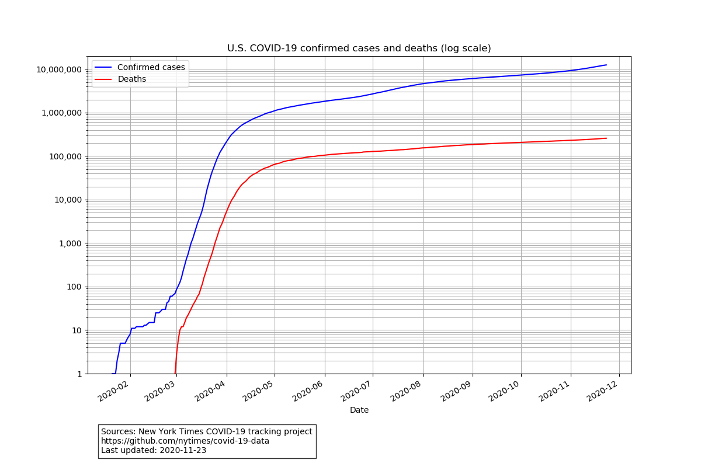
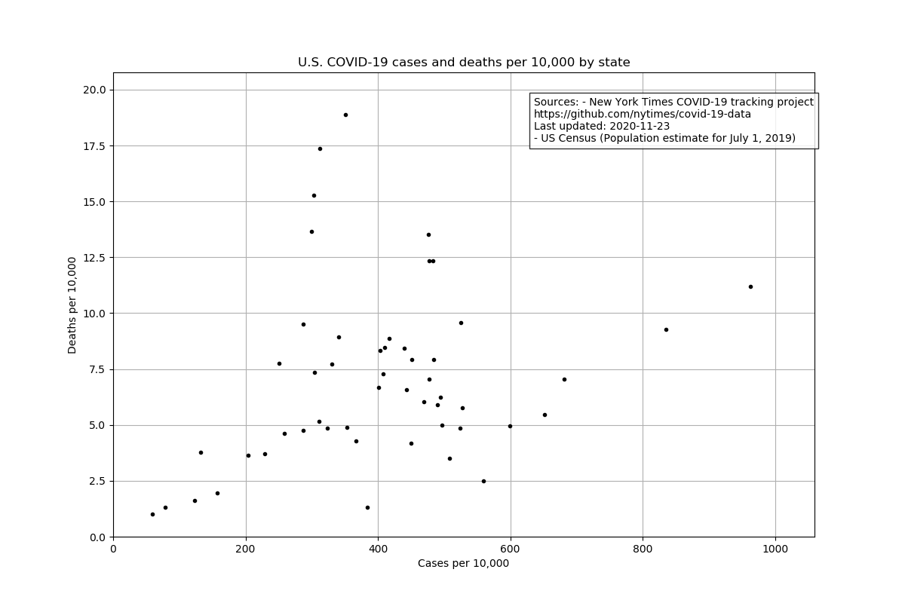

# Plots and other files based on the *New York Times*' COVID-19 data

* Christopher Phan <cphan@chrisphan.com>

The *New York Times* has been compiling COVID-19 data from various state health departments. They have published the data on GitHub, at: <https://github.com/nytimes/covid-19-data>

There are two files of interest in their repository: [``us-states.csv``](https://github.com/nytimes/covid-19-data/blob/master/us-states.csv) and [``us-counties.csv``](https://github.com/nytimes/covid-19-data/blob/master/us-counties.csv). In these CSV files, each row represents the number of (confirmed) cases and deaths in a particular geographical area as of a particular date. For example, the first two rows of ``us-states.csv`` are
~~~
date,state,fips,cases,deaths
2020-01-21,Washington,53,1,0
~~~

## Important disclaimers:

* I am **not** an epidemologist.

* "Number of cases" is the number of **confirmed** cases. The *Times* gives the following description:
> Confirmed cases are patients who test positive for the coronavirus. We consider a case confirmed when it is reported by a federal, state, territorial or local government agency.

## Number of confirmed cases and deaths in the U.S. over time

## Scatterplot showing the number of confirmed cases and deaths (per capita) in each state

The population data are from the U.S. Census: https://www2.census.gov/programs-surveys/popest/tables/2010-2019/state/totals/nst-est2019-01.xlsx

## CSV files

The format of the *Times*' ``us-states.csv`` file is not friendly to plotting with common spreadsheet software. The CSV  files in this repository have been formatted for easy graphing and analysis in your favorite spreadsheet software.

## Running the script

The main script is ``nyt_data.py``. To run this script, you will need to place the following in the parent folder:

* ``../nst-est2019-01.xlsx``: https://www2.census.gov/programs-surveys/popest/tables/2010-2019/state/totals/nst-est2019-01.xlsx
* The repository ``../covid-19-data/``: a clone of the repository at https://github.com/nytimes/covid-19-data

## File descriptions:

* ``nyt_by_state.png``/``nyt_by_state.pdf``: The "scatterplot showing the number of confirmed cases and deaths (per capita) in each state"

* ``nyt_cases.csv``: Cases in each state by date (rows: dates, columns: states)

* ``nyt_cases_and_deaths.png``/``nyt_cases_and_deaths.pdf``: The "number of confirmed cases and deaths in the U.S. over time" plot

* ``nyt_cases_transpose.csv``: Cases in each state by date (rows: states, columns: dates)

* ``nyt_data.py``: Script to create the plots and files

* ``nyt_deaths.csv``: Deaths in each state by date (rows: dates, columns: states)

* ``nyt_deaths_transpose.csv``: Deaths in each state by date (rows: states, columns: dates)

* ``nyt_total_us_cases_and_deaths.csv``: Total U.S. cases and deaths by date

* ``states/nyt_``*state*``.csv``: Cases and deaths in a state by date

* ``states/nyt_``*state*``.png``/``states/nyt_``*state*``.pdf``: Plot of cases and deaths in a state by date

## License

For the files
* ``nyt_data.py``
* ``README.md`` (the Markdown file, without the images)
* ``states/README.md`` (the Markdown file, without the images)

the following license applies:

> Copyright 2020 Christopher Phan
>
> Permission is hereby granted, free of charge, to any person obtaining a copy of this software and associated documentation files (the "Software"), to deal in the Software without restriction, including without limitation the rights to use, copy, modify, merge, publish, distribute, sublicense, and/or sell copies of the Software, and to permit persons to whom the Software is furnished to do so, subject to the following conditions:
>
> The above copyright notice and this permission notice shall be included in all copies or substantial portions of the Software.
>
> THE SOFTWARE IS PROVIDED "AS IS", WITHOUT WARRANTY OF ANY KIND, EXPRESS OR IMPLIED, INCLUDING BUT NOT LIMITED TO THE WARRANTIES OF MERCHANTABILITY, FITNESS FOR A PARTICULAR PURPOSE AND NONINFRINGEMENT. IN NO EVENT SHALL THE AUTHORS OR COPYRIGHT HOLDERS BE LIABLE FOR ANY CLAIM, DAMAGES OR OTHER LIABILITY, WHETHER IN AN ACTION OF CONTRACT, TORT OR OTHERWISE, ARISING FROM, OUT OF OR IN CONNECTION WITH THE SOFTWARE OR THE USE OR OTHER DEALINGS IN THE SOFTWARE.

The rest of the files in the repository (every ``csv``, ``png`` and ``pdf``) are based on the *New York Times*' data and are subject to [their license](https://github.com/nytimes/covid-19-data/blob/master/LICENSE):

> Copyright 2020 by The New York Times Company
>
> In light of the current public health emergency, The New York Times Company is providing this database under the following free-of-cost, perpetual, non-exclusive license. Anyone may copy, distribute, and display the database, or any part thereof, and make derivative works based on it, provided  (a) any such use is for non-commercial purposes only and (b) credit is given to The New York Times in any public display of the database, in any publication derived in part or in full from the database, and in any other public use of the data contained in or derived from the database.
>   
> By accessing or copying any part of the database, the user accepts the terms of this license. Anyone seeking to use the database for other purposes is required to contact The New York Times Company at covid-data@nytimes.com to obtain permission.
>
> The New York Times has made every effort to ensure the accuracy of the information. However, the database may contain typographic errors or inaccuracies and may not be complete or current at any given time. Licensees further agree to assume all liability for any claims that may arise from or relate in any way to their use of the database and to hold The New York Times Company harmless from any such claims.
